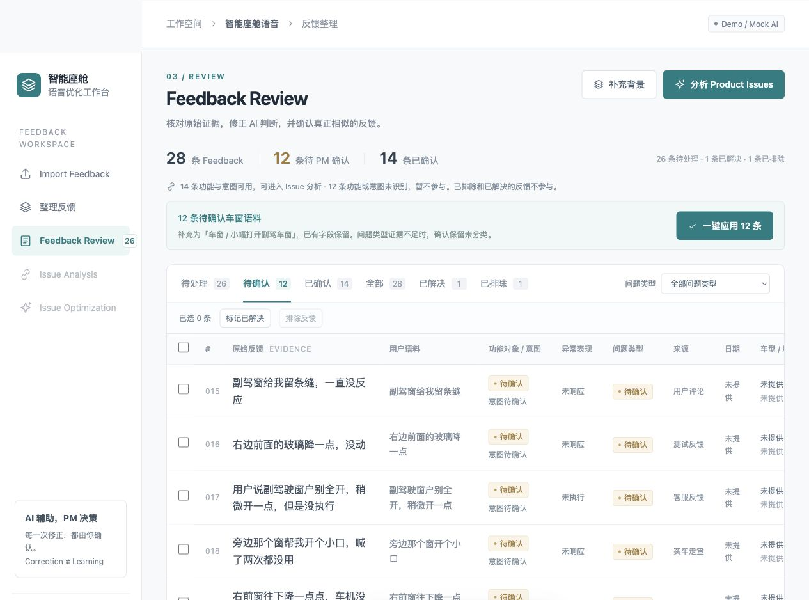

# 智能座舱语音优化工作台
AI Cockpit Voice Optimization Copilot

一个面向智能座舱语音产品经理的 AI 产品 Demo，将零散 Feedback 转化为 Evidence-backed Product Issues，并进一步辅助完成语料泛化优化。

**AI Product Interactive Prototype · Interactive Mock AI Prototype**  
**Demo data / Mock AI output · 未连接真实生产系统**

**Live Demo：TODO — GitHub Pages 开启后，在这里粘贴实际访问链接。**  
[本地演示入口](index.html) · [示例 Excel](examples/semantic-customization-passenger-window-demo.xlsx)

| | 项目定位 |
| --- | --- |
| **Who** | 智能座舱语音产品经理 |
| **Problem** | 大量用户 / 测试反馈需要人工阅读、归类、定位问题，并进一步完成重复的语料泛化工作。 |
| **Solution** | Feedback → Structured Feedback → Product Issues → Evidence → Optimization Recommendation → Utterance Generalization Draft |
| **Scope** | Interactive Mock AI Prototype。当前使用 Mock Data，AI 输出为模拟结果，重点展示 AI Product Workflow、Human-in-the-loop 和 Evidence tracing。 |

主演示场景为 **副驾车窗微开指令无响应**。项目灵感来自智能座舱语音产品工作中观察到的工作流痛点；所有公开 Demo 数据、界面和协议均重新构造，不包含原公司的业务数据、内部文档或生产配置。

## 核心产品设计

- **AI uncertainty**：无法判断的字段保持“待确认”，PM 可按证据补充；证据不足时可以保留未分类。
- **Correction ≠ Learning**：修改一条结果不代表 AI 永久学习；“记住用于以后”是独立、默认关闭的 Mock 操作。
- **Human-in-the-loop**：相似反馈默认未选，PM 查看原文后主动勾选；只应用到已选数据。
- **Evidence tracing**：Candidate Issue 可追溯到原始 Feedback，调整归属也保留原文。**Every insight must be traceable to evidence.**
- **AI recommends, PM decides**：Issue、优化类型、表达模式和 Candidate Rule 均为候选建议，最终判断和保存由 PM 完成。

## Recommended Demo Flow · 3–5 分钟

### 1. 导入与结构化结果 · 约 30 秒

点击 **载入示例反馈 → 开始识别 → 进入审核**，查看结构化字段，点击 **待确认 12** 查看待确认项。示例共 28 条：14 条已确认、12 条车窗待确认、1 条排除、1 条已解决。

### 2. PM 修正与相似反馈批量处理 · 约 60 秒

打开 **FB-015：副驾窗给我留条缝，一直没反应**。将功能对象设为 **车窗**，用户意图填写 **小幅打开副驾车窗**，问题类型证据不足时保留待确认，再点击 **仅保存本条**。

点击 **应用到相似反馈 → 查看 11 条**，逐条阅读原文并主动勾选。主演示将 FB-016–FB-026 保留在这组 Mock 意图下，选择后点击 **应用到已选 11 条**。此时原本的 12 条车窗反馈完成审核，原文和问题类型保留，默认不记住。

> 快速体验可用审核页的“一键应用 12 条”。想看 Human-in-the-loop，请走上面的单条修正与候选选择。

### 3. Issue 与 Evidence · 约 45 秒

关闭反馈详情，点击 **分析 Product Issues**。打开 **副驾车窗微开指令无响应**，核对 **12 条 Evidence**；可打开单条原始 Feedback。点击 **确认 Issue → 进入优化**，查看模拟的优化推荐与能力检查。

### 4. 语料泛化与 Coverage Preview · 约 60 秒

AI 建议为 **原有功能语料泛化**。点击 **确认并进入语料泛化**，查看 Evidence、对象 / 动作表达和 Candidate Rule。

**旁边那个窗 / 旁边窗户** 默认不加入；PM 需要按上下文判断。点击槽位展开六个动作候选，再点击 **覆盖检查**。简洁默认规则按原文进行有限文本匹配，结果为 **1 / 12**；这不代表语音识别准确率或线上执行效果。

```text
(副驾窗|副驾驶窗|右前窗|副驾玻璃)<微开动作>
```

### 5. 草稿与业务模板 · 约 30 秒

点击 **保存为优化草稿 → 导出语义定制模板**。Excel 包含 **语义定制 / 槽位** 两张 Sheet；一级功能为车窗，二级功能为副驾车窗，句式、槽位和 Evidence 来自最终保存的快照。修改表达后须重新保存，导出才会同步。

## 关键界面

**Feedback Review：结构化字段与待确认项**



**Similar Feedback Review：主动选择真正需要处理的数据**


**Issue Evidence：从候选问题回到原始证据**


<details>
<summary>Utterance Generalization：查看完整工作台与已保存草稿</summary>


</details>

完整九张当前版本截图见 [screenshots/README.md](screenshots/README.md)，包括优化推荐、Coverage Preview、优化草稿及模板导出。

## Demo JSON / 建议语义

Excel 中的 `SET / windowControl / semantic.slots` 为虚构车窗微开协议示例，用于展示提单结构。

**Fictional demo schema, not derived from production configuration.**

这些字段和取值没有经过真实平台查询，不来自公司生产配置。导出的 Excel 用于 V1 Demo，正式环境须匹配实际平台模板、协议及校验规则，不能直接视为生产可导入文件。文件在浏览器本地生成；“提交到语音平台 · Demo”只显示说明，不执行提交或上线。

## Limitations / V1 Scope

当前没有真实 LLM、真实 AI Evaluation、真实企业数据源接入、真实语音引擎验证、真实生产协议查询、数据库、登录 / 权限、多人协作、自动上线或生产平台提交。

预设优化推荐与泛化工作台仅提供副驾车窗微开主案例；其他功能模块只用于反馈 / Issue 分析。“降一小截”为明确标注的 Demo 补充候选，原文无直接匹配。页面状态只存于当前浏览器内存，刷新后清空。

## Next Steps · 仅未来方向

- 接入真实 LLM，并用真实标注数据评估 Feedback classification / Issue clustering。
- 对接实际语音平台的模板、协议、冲突校验和执行验证。
- 增加历史 Issue、版本对比与更多 Optimization Workflow。

## 运行与 GitHub Pages

- 下载完整项目后，用浏览器打开 **index.html** 或中文演示 HTML。无构建步骤，无安装依赖，无产品后端。
- GitHub 的 HTML 文件预览显示源码；交互体验请使用 GitHub Pages 或本地浏览器。
- 上传时将这个文件夹内的内容放到仓库根目录，保留 `assets/` 等目录结构。
- 开启 Pages：**Settings → Pages → Deploy from a branch → 仓库默认分支（通常 main）→ /(root) → Save**。[GitHub 官方说明](https://docs.github.com/en/pages/getting-started-with-github-pages/configuring-a-publishing-source-for-your-github-pages-site)
- 部署完成后，复制 Pages 页面给出的实际访问地址，替换本 README 顶部的 **Live Demo：TODO**，再把仓库置顶到个人主页。

## 项目结构与可选验证

| 文件 / 目录 | 用途 |
| --- | --- |
| `index.html` | GitHub Pages 的直接首页入口 |
| `演示-智能座舱语音优化工作台.html` | 方便识别的本地入口，跳转到 index.html |
| `assets/` | JavaScript、CSS 与 Mock Data；核心产品流程 |
| `screenshots/` | 九张当前版本截图 |
| `examples/` | 带 Demo / Fictional schema 标识的示例 Excel |
| `dev-tests/` | 无依赖业务回归检查 |
| `dev-tools/` | 可选静态预览工具，应用运行不依赖它 |

技术方案为 HTML、CSS、JavaScript。已安装 Node.js 时可运行 `npm test`；`npm start` 仅用于本地静态预览，不连接 AI 或业务平台。
